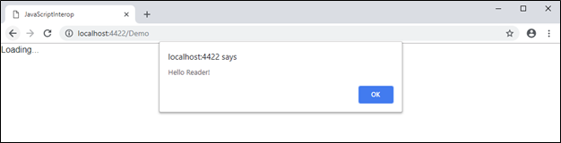
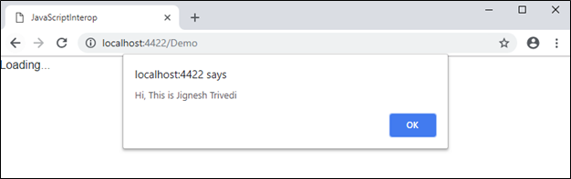

## JavaScript Interop 

### Introduction 
Blazor is a .net framework that run in the browser on a real.NET runtime (Mono) via Web Assembly. Blazor is experimental project and till date it is not in production so many changes are going on. WebAssembly is a web standard which defines a binary format just like lower level assembly language. So, it enables executing code nearly as fast as running native machine code. It was developed at the W3C (World Wide Web Consortium). It defines an AST (Abstract Syntax Tree) which gets stored in binary format. It is supported by all the major browsers without any plug ins. Mono is a Microsoft .net framework implementation based on the ECMA standards for C# and CLR (Common Language Runtime). Mono's runtime is compiled into WebAssembly and its IL interpreter is used to run managed code.

In most condition when we do programming with Blazor, C# code will execute in browser via WebAssembly. Blazor application can also invoke JavaScript function from C# (.net) and vice versa. This feature is refer as "JavaScript Interop". 

### Calling JavaScript function from C# (.net) code
There are many scenario when we required to call JavaScript function from Blazor application. Blazor application use IJSRuntime interface to call JavaScript from .net application. This interface can accessible using JSRuntime.Current static property. Using InvokeAsync<T> method of IJSRuntime abstraction, we can call the JavaScript function. This method takes function name and function parameters as argument.
```
Task<T> InvokeAsync<T>(string identifier, params object[] args);
```
Example
In the following example, I have invoked JavaScript function on page init method.
```
protected override async Task OnInitAsync()
{
    await JSRuntime.Current.InvokeAsync<object>("CalledJSFunction");
}
```
Here "CalledJSFunction" is JavaScript function name that called on page initialization. We can define JavaScript function either in index.html (under wwwroot folder) or separate JavaScript file that need to register after registering blazor.webassembly.js.
```
index.html
<!DOCTYPE html>
<html>
<head>
	....
	....
</head>
<body>
    <app>Loading...</app>

    <script src="_framework/blazor.webassembly.js"></script>
    <script>
        function CalledJSFunction() {
            alert("Hello Reader!");
        }
	</script>
</body>
</html>
```
Output


We can also pass the parameters to the JavaScript function using second argument of InvokeAsync method. This will accept value as objects. In the following Example, I have pass my name as JavaScript function argument.
```
protected override async Task OnInitAsync()
{
   await JSRuntime.Current.InvokeAsync<object>("CalledJSFunctionWithParameter", "Jignesh Trivedi");
}
```
function CalledJSFunctionWithParameter(name) {
   alert("Hi, This is " + name);
}



### Calling .net (C#) function from JavaScript
Blazor application enable us to call .net (C#) method from JavaScript. There are two JavaScript:DotNet.invokeMethod and DotNet.invokeMethodAsunc function defined that used to call C# method from JavaScript. Here We also need to pass the assembly contains this function. Following is definition of invokeMethodAsync method.
```
DotNet.invokeMethodAsync(assemblyName, functionname).then(data => { ... })
```
To invoke C# method from JavaScript, Method must have following characteristics.

* The method must decorated with "JSInvokable" atribute
* The method must be public
* The method may either static or instance level (this is only supported by Blazor 0.5.0 and above) 
* Identifier for the method must be unique
* The method must non-generic

Example:
Following function is called from the JavaScript. I have defined this function as static within DemoComponent and here just returning static string from this function.

DemoComponent.cs
```
[JSInvokable("CalledByComponentScript")]
public static string CalledByComponentScript()
{
    return "Hello from C#";
}
```
Index.html
```
function CalledCSFunction() {
    DotNet.invokeMethodAsync("JavaScriptInterop", 'CalledByComponentScript')
        .then(data => {
            alert(data)
        })
}
```
I have called this function on button click from demo.cshtml file.

demo.cshtml
```
<button class="btn btn-success" onclick="CalledCSFunction()">Call Java Script</button>
```
Output


We can also pass the parameters to the C# (.net) function using third argument of DotNet.invokeMethodAsync method. This will accept value as objects. In the following Example, I have pass my name as JavaScript function argument.

DemoComponent.cs
```
[JSInvokable("CalledByComponentScriptWithParameter")]
public static string CalledByComponentScript(string name)
{
    return "Hello, " + name + "!";
}
```
Index.html
```
function CalledCSFunctionWithParameter() {
    var yourName = "Jignesh Trivedi"
    DotNet.invokeMethodAsync("JavaScriptInterop", 'CalledByComponentScriptWithParameter', yourName)
        .then(data => {
            alert(data)
        })
}
```
I have called this function on button click from demo.cshtml file.

demo.cshtml
```
<button class="btn btn-success" onclick="CalledCSFunctionWithParameter()">Call Java Script (with parameter)</button>
```
Output


In preceding, I have called static C# methods from JavaScript function. The Blazor 0.5.0 allows to call .net instance method from the JavaScript. To do this, we need to pass the instance of class to the JavaScript by using DotNetObjectRef class instance. This class instance pass the our object instance to the JavaScript and we can invoke the method using passed object instance using the invokeMethod or invokeMethodAsync functions. 

Example:
In the following example, I have created class named "MyHelper" and pass the instance of this class to the JavaScript in Init method of the component. In JavaScript, I have hold this instance and called the C# method on button click. In the instance method, I return the string getting as parameter.
```
public class MyHelper
{
	[JSInvokable("InstanceMethod")]
    public string InstanceMethod(string myMessage)
    {
        return myMessage;
    }
}
```

DemoComponent
```
protected override async Task OnInitAsync()
{
	await JSRuntime.Current.InvokeAsync<object>("passInstanceOfHelper", new DotNetObjectRef(new MyHelper()));
}
```
Index.html
```
var myObject;
function passInstanceOfHelper(instance) {
    myObject = instance;
}

function CallInstanceMethod() {
    myObject.invokeMethodAsync('InstanceMethod', "Hello Friends!").then(r => {
        alert(r);
    });
}
```
Output


If we call C# function from JavaScript and update any C# variable / property that visible on screen, the the change not getting reflected. Blazor component use "StateHasChanged" method to update the UI component. But this function cannot be called in static method and instance method are in different class. This can be achieved by using instance method and pass object of current component to that instance. 

DemoComponent
```
public class DemoComponent : BlazorComponent
{
    public string message = "";
	protected override async Task OnInitAsync()
	{
		 await JSRuntime.Current.InvokeAsync<object>("passInstanceOfHelperUIUpdate", new DotNetObjectRef(new MyHelper(this)));
	}
	public void UpdateUI()
    {
        this.StateHasChanged();
    }
}
```
```
public class MyHelper
{
    DemoComponent _component;
    public MyHelper(DemoComponent component)
    {
        _component = component;
    }
	[JSInvokable("UIUpdateExample")]
    public void UIUpdateExample()
    {
        _component.message = "Hello, Reader!";
        _component.UpdateUI();
    }
}
```
Index.html
```
var myClassObject;
function passInstanceOfHelperUIUpdate(instance) {
    myClassObject = instance;
}

function updateUIExample() {
    myClassObject.invokeMethodAsync('UIUpdateExample').then(r => {
        console.log('Hello!');
    });;
}
```
Demo.cshtml
```
<div class="col-md-4">
    <button class="btn btn-success" onclick="updateUIExample()">Update UI Example</button>
</div>
<br />
@message
```

Output


### Summary
Using JavaScript Interop functionality, we can call JavaScript function from C# (.net) and also we can call C# (.net) method from JavaScript. 