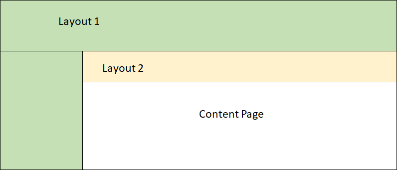

### Introduction

Some part of page remains as is throughout the application such as header, navigation, footer etc. ASP.net application introduced MasterPage and ASP.net MVC introduced layout page that contains common UI parts, so we need not to write duplicate code in every page. Blazor is also have Layouts that resolved duplicate code problem.

Basically, every part of application in blazor is component, so Layout is also consider as a component in Blazor application. The component may contains Razor syntax, C# code, databinding etc. The layout implement Microsoft.AspNetCore.Blazor.Layouts.ILayoutComponent interface. This interface add "Body" Property to the Layout so content of the page rendered inside the layout. It is very similar to Razor Layout view except server side property implementation. 

The default template of Blazor contains MainLayout.cshtml under the shared folder. It working as Layout page. 

Example:
```
@implements ILayoutComponent

<div class="container-fluid">
    <div class="row">
        <div class="col-sm-3">
            <NavMenu />
        </div>
        <div class="col-sm-9">
            @Body
        </div>
    </div>
</div>

@functions {
    public RenderFragment Body { get; set; }
}
```
There are mainly two ways to render component with Layouts
* 1) Using @layout directive or Layout attribute
* 2) Define layout globally

#### Using @layout directive or Layout Attribute
We can define layout for Blazor component by using @layout directive. At the time of compilation @layout directive converted into Layout attribute which applied to the Blazor component class. Either way, if our component is class base, we can use Layout attribute directly in class.

Example
Using @layout directive 
```
@layout MainLayout
@page "/usingdirective"

<h2>@Title</h2>

@functions {
    string Title = "Layout page defined using @layout directive";
}
```
Using Layout attribute
```
using BlazorDemoApp.Shared;
using Microsoft.AspNetCore.Blazor.Components;
using Microsoft.AspNetCore.Blazor.Layouts;
using Microsoft.AspNetCore.Blazor.RenderTree;

namespace BlazorDemoApp.Pages
{
    [Route("/usingattribute")]
    [Layout(typeof(MainLayout))]
    public class LayoutdefinedUsingattribute : BlazorComponent
    {
        public string Title { get; set; } = "Layout page defined using layout Attribute";
        protected override void BuildRenderTree(RenderTreeBuilder builder)
        {
            builder.OpenElement(1, "h2");
            builder.AddContent(2, Title);
            builder.CloseElement();
        }
    }
}
```
#### Define layout globally
The _ViewImports.cshtml file introduced in ASP.net MVC and it provide a mechanism to make directives available to Razor pages globally so that we do not required to add them to pages individually. We can also use this file to define Layout page in Blazor. If we define Layout page in this file, Layout automatically applied to all the Blazor pages in the folder heirarchy.

_ViewImports.cshtml
```
@layout MainLayout
```
Note that, we can also define the namespaces those are used in all the views in folder to _viewImports.cshtml file. Default template of the Blazor is also use this file for Layout selection. 

#### Nested layouts
Blazor component is also supports  the nested layouts i.e. Blazor component can reference a layout which reference another layout. 

Example:
In following example, I have created nested layout. The Master layout page contains header (MainLayout.cshtml) and the other layout has header and it refer MasterLayout component as a Layout. 

 

MainLayout.cshtml
```
@implements ILayoutComponent

<div class="container-fluid">
    <div class="row">
        <div class="col-sm-3">
            <NavMenu />
        </div>
        <div class="col-sm-9">
            @Body
        </div>
    </div>
</div>

@functions {
    public RenderFragment Body { get; set; }
}
```
OtherLayout.cshtml
```
@layout MainLayout
@implements ILayoutComponent

<div class="container-fluid">
    <div class="row">
        <div class="col-sm-12">
            <h2>Nested Layout Example</h2>
        </div>
    </div>
    <div class="row">
        <div class="col-sm-12">
            @Body
        </div>
    </div>
</div>

@functions {
    public RenderFragment Body { get; set; }
}
```
nestestedLayout.cshtml
```
@layout OtherLayout
@page "/nestedlayout"

<h3>@Title</h3>

@functions {
    string Title = "This is child page";
}
```
#### Summary
Layout page help us to reduced duplicate code in our application and help us to make look and fill consistence through out application. It is very similar to Layout in ASP.net MVC application. Blazor is also supports the nested layout. 
