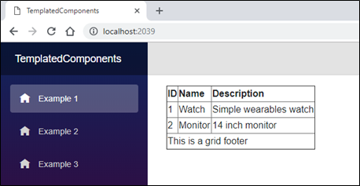

## Templated Components

Introduction 
Just like modern client frameworks (such as  Angular), Blazor has components at the core part. It uses the combination of Razor, HTML and C# code as a component. A component is the base element of the Blazor application, i.e., every page is considered as a component in Blazor. Blazor use the Razor template engine that generate HTML and served to web browsers. We can mix HTML and C# syntax in the Razor template and Razor engine will compiled Razor template and generate the HTML.

Blazor(Version 0.6.0) supports the templated component. It is component which accept one or more UI template as parameters and these parameters can be used to component rendering. It allows us to write high-level reusable components. Using templated component, we can write the generic or more reusable component. 

We can create the template component by one or more component parameters of type RenderFragment or RenderFragment<T>. The RenderFragment is a part of UI which is render by the component. It may have parameter that use during the rendering of component or RenderFragment is invoked.

Example
A list view component that allows us to define template for rendering each item of the list and same as, we can create template for the header, footer and each row for grid view component. 
 
 In the following example, I have created the Templated component for table (grid). Here, I have three fragment of the templated component:Header, Rows and Footer. All these fragments are generated using the parameters. The parameter have actual HTML and context data that need to replace when generating the HTML.

 GridTemplate.cshtml
```
 @typeparam TItem

<table border="1">
    <thead>
        <tr>@Header</tr>
    </thead>
    <tbody>
        @foreach (var item in Items)
        {
            <tr>@Row(item)</tr>
        }
    </tbody>
    <tfoot>
        <tr>@Footer</tr>
    </tfoot>
</table>

@functions {
    [Parameter]
    RenderFragment Header { get; set; }

    [Parameter]
    RenderFragment<TItem> Row { get; set; }

    [Parameter]
    RenderFragment Footer { get; set; }

    [Parameter]
    IReadOnlyList<TItem> Items { get; set; }
}
```
When we use the templated component in Blazor component, we can specify the template parameter using the child element and name of template parameter must match with child element.

We can access the data that passed by the template component (of type RenderFragment<T>)using "context" property. 

example1.cshtml
```
@page "/"

@inject HttpClient Http
@using TemplatedComponents.Model
@if (data == null)
{
<p><em>Loading...Test</em></p>
}
else
{
<GridTemplate Items="@data">
    <Header>
        <th>ID</th>
        <th>Name</th>
        <th>Description</th>
    </Header>
    <Row>
        <td>@context.Id</td>
        <td>@context.Name</td>
        <td>@context.Description</td>
    </Row>
    <Footer>
        <td colspan="3">This is a grid footer</td>
    </Footer>
</GridTemplate>
}
@functions {
    MyItems[] data;

    protected override async Task OnInitAsync()
    {
           data = await Http.GetJsonAsync<MyItems[]>("sample-data/test.json");
    }
}
```


The "context" parameter is the implicit parameter, however we can change the parameter using the "Context" attribute on the templated component.

example1.cshtml
```
<GridTemplate Items="@data">
	.....
	....
	<Row Context="test">
		<td>@test.Id</td>
		<td>@test.Name</td>
		<td>@test.Description</td>
	</Row>
	....
	....
</GridTemplate>
```
Alternatively, we can specify this attribute on the component element. So, this attribute applies to all specified template parameters. 

example1.cshtml
```
<GridTemplate Items="@data" Context="test">
	....
	....
</GridTemplate>
```
The templated components are always generically typed. In above example, the templated component can rendered as IEnumerable<T>. The directive @typeparam is used to specify type parameters. 

GenericComponent.cshtml
```
@typeparam TItem

@foreach (var item in Items)
{
    @ItemTemplate(item)
}

@functions {
    [Parameter] 
    RenderFragment<TItem> ItemTemplate { get; set; }
    [Parameter] 
    IReadOnlyList<TItem> Items { get; set; }
}
```
The parameter type can be identified when using generic-typed components. We can also explicitly specified type using the attribute and the name of the parameter must match.

Example2.cshtml
```
@page "/example2"

@inject HttpClient Http
@using TemplatedComponents.Model;
@if (data == null)
{
    <p><em>Loading...Test</em></p>
}
else
{
    <ui>
        <GenericComponent Items="@data" TItem="MyItems">
            <ItemTemplate>
                <li>
                    @context.Name
                </li>
            </ItemTemplate>
        </GenericComponent>
    </ui>
}
@functions {
    MyItems[] data;

    protected override async Task OnInitAsync()
    {
        data = await Http.GetJsonAsync<MyItems[]>("sample-data/test.json");
    }
}
```
### Razor templates
We can also defined render fragment using Razor template syntax. We can use the Razor template to define RenderFragment and RenderFragment<T> values. The templated components can be render using Razor template with argument or rendered directly.
```
@page "/example3"

@inject HttpClient Http
@using TemplatedComponents.Model;

@{
    RenderFragment template = @<p>Hello C# Corner Reader!</p>;
    RenderFragment<MyItems> ItemTemplate = (item) => @<li>@item.Name.</li>;
}

@if (data == null)
{
    <p><em>Loading...Test</em></p>
}
else
{

@template
<ul>
    @foreach (var item in data)
    {
        @ItemTemplate(item)
    }
</ul>
}
@functions {
    MyItems[] data;

    protected override async Task OnInitAsync()
    {
        data = await Http.GetJsonAsync<MyItems[]>("sample-data/test.json");
    }
}
```
### Summary

The templated component are supported by Blazor. It is component which accept one or more UI template as parameters and these parameters can be used to component rendering. It allows us to write high-level reusable components. Using templated component, we can write the generic or more reusable component.

